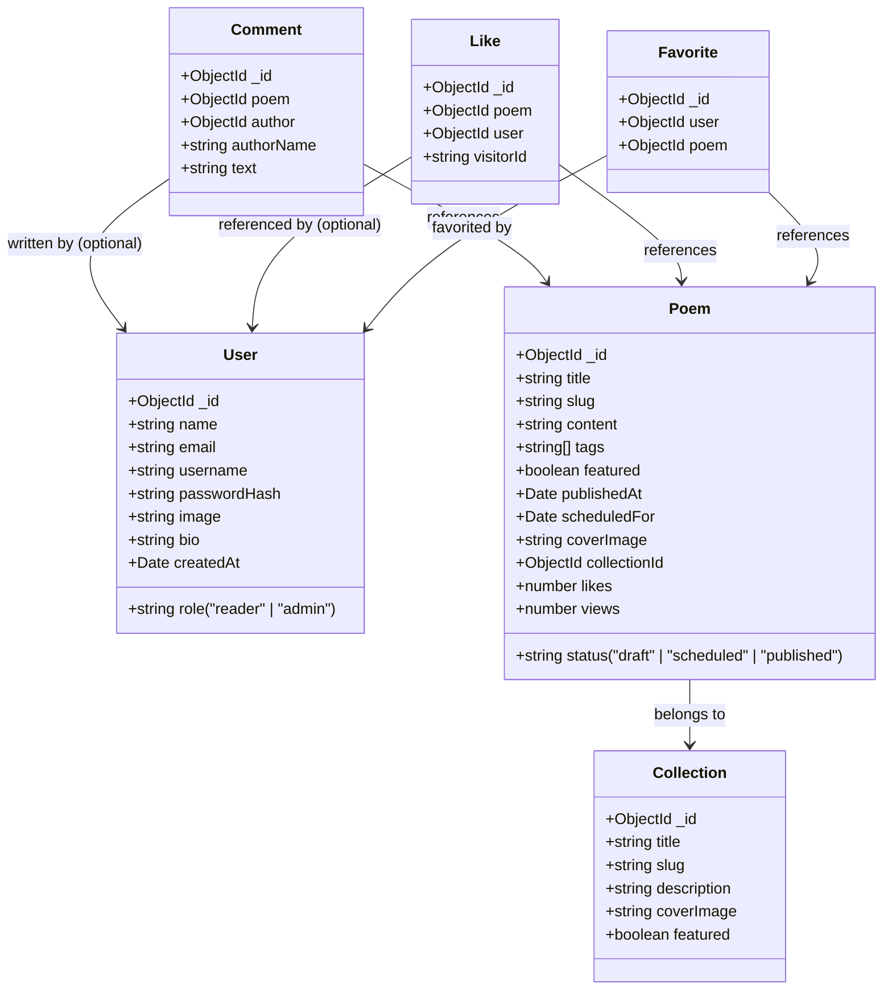

# PGpoetry Documentation & Product Status

Welcome to the official documentation for **PGpoetry** — *Every verse, a priceless gift.* 
This document outlines the architecture, database schema, tech stack, integrations, feature specifications, and the current working/failing status of the project.

---

## 📖 Executive Summary
PGpoetry is a minimalist, emotion-driven poetry platform designed for a seamless reading experience.
* **For Readers**: A serene environment to browse, search, collect, and engage with original poetry (like, favorite, comment, and share).
* **For the Author (Admin)**: A private admin studio to compose poems via a rich Tiptap editor, manage collections, schedule publishes, track engagement metrics, and view library analytics.

---

## 🛠️ Technology Stack

| Layer | Technology | Version / Configuration |
| :--- | :--- | :--- |
| **Framework** | Next.js (App Router) + React | Next.js 16.2+, React 19.2+ |
| **Language** | TypeScript | v6.0+ |
| **Styling** | Tailwind CSS + shadcn/ui | Tailwind CSS v4, Lucide React icons, tw-animate-css |
| **Database** | MongoDB + Mongoose | MongoDB Node Driver v6+, Mongoose v9+ |
| **Authentication** | Auth.js (Next-Auth) | v5.0.0-beta (Credentials & Google OAuth) |
| **Media Uploads** | Cloudinary | next-cloudinary wrapper for secure media handling |
| **Rich Text Editor**| Tiptap | Core starter kit, React integration, HTML output |

---

## 📂 Project Structure & Architecture

The application is structured following modern Next.js App Router conventions:

```text
src/
├── app/
│   ├── (public pages)        # Home page, /poems, /collections, /profile, and detail views
│   │   ├── collections/      # Collection browsing (/collections & /collections/[slug])
│   │   ├── poems/            # Poem list page (/poems & /poems/[slug])
│   │   └── profile/          # User bio, favorites list, and comments history
│   ├── admin/                # Admin Studio (/admin, /admin/poems, /admin/collections, /admin/analytics)
│   ├── api/                  # Route handlers (Auth.js setup & Admin secure upload handler)
│   ├── actions/              # Server Actions (Mutations for admin CRUD, profile, and engagement)
│   ├── globals.css           # Global Tailwind stylesheet
│   ├── layout.tsx            # Main HTML layout, providers, and header/footer wrapper
│   └── rss.xml/              # Dynamically generated RSS feed route
├── components/               # Custom UI Components (buttons, inputs, cards, comment section)
│   ├── admin/                # Admin-specific components (Tiptap editor, collections dropdown)
│   ├── auth/                 # Sign-in and sign-up visual components
│   ├── engagement/           # Social components: LikeButton, FavoriteButton, CommentSection, ShareButton
│   ├── ui/                   # Primitive shadcn elements (Dialog, Tabs, Select, Button, Input)
│   └── theme-provider.tsx    # Light/Dark mode wrapper
├── lib/                      # Database connections, Auth.js configs, rate limiting, and formatting utilities
├── models/                   # Mongoose database models
└── types/                    # Shared TypeScript interfaces (serializable models for Server/Client boundaries)
```

---

## 🗄️ Database Schemas & Models

Mongoose models are registered in `src/models/` and utilize pre-save/pre-validate hooks to format inputs automatically.



### 1. Poem Schema (`src/models/Poem.ts`)
* `title`: String, required, max 200 chars.
* `slug`: String, unique, auto-generated from title using `slugify`.
* `content`: String (HTML text), required.
* `tags`: Array of lowercased strings.
* `featured`: Boolean, default `false`.
* `status`: "draft" | "scheduled" | "published".
* `publishedAt`: Date (set automatically when status transitions to `published`).
* `scheduledFor`: Date, required if status is `scheduled`.
* `coverImage`: String, defaults to empty string.
* `collectionId`: Mongoose ObjectId referencing `Collection`, default `null`.
* `likes`: Number, denormalized count for high-performance listing pages.
* `views`: Number, increments on every view.

### 2. Collection Schema (`src/models/Collection.ts`)
* `title`: String, required, max 160 chars.
* `slug`: String, unique, auto-generated from title using `slugify`.
* `description`: String, max 600 chars.
* `coverImage`: String.
* `featured`: Boolean, default `false`.

### 3. Comment Schema (`src/models/Comment.ts`)
* `poem`: ObjectId referencing `Poem`, required.
* `author`: ObjectId referencing `User`, optional (allows anonymous comments).
* `authorName`: String, defaults to User Name or anonymous username, max 60 chars.
* `text`: String, required, max 1000 chars.

### 4. Like Schema (`src/models/Like.ts`)
* Used for tracking and de-duplicating likes.
* `poem`: ObjectId referencing `Poem`.
* `user`: ObjectId referencing `User` (if logged in).
* `visitorId`: String (stable signed cookie UUID for guest de-duplication).

### 5. Favorite Schema (`src/models/Favorite.ts`)
* Used to compile readers' personal reading lists.
* `user`: ObjectId referencing `User`.
* `poem`: ObjectId referencing `Poem`.

### 6. User Schema (`src/models/User.ts`)
* `name` / `username` / `email`: String.
* `passwordHash`: String (omitted for Google OAuth users).
* `role`: "reader" | "admin" (Admin role automatically assigned if email matches `ADMIN_EMAIL` env variable).
* `bio` / `image`: Metadata fields.

---

## ⚡ Key Workflows & System Integrations

### 1. Authentication (Credentials & Google OAuth)
* Leverages **Auth.js v5** setup under `src/auth.ts` and `src/auth.config.ts`.
* Incorporates a MongoDB adapter.
* Implements automatic role mapping on login: if the user's email matches the environment's `ADMIN_EMAIL`, they are granted the `"admin"` role, unlocking the Admin Studio.

### 2. Like De-duplication (Visitor Cookie)
* Registered users' likes are bound to their user ID.
* Anonymous likes use a browser tracking cookie (`pgp_vid`) storing a stable UUID set for 1 year. The toggle action checks for this cookie via `src/lib/visitor.ts` to block duplicate likes.

### 3. IP-Based Rate Limiting
* An in-memory rate-limiter in `src/lib/rate-limit.ts` helps prevent spam.
* **Likes**: Blunted to 30 requests per minute per IP address.
* **Comments**: Limited to 6 comments per minute per IP address.
* Stale limit buckets are swept every 10 minutes from memory.

### 4. Scheduled Publishing
* When creating a poem, admins can schedule it for a future date.
* When an admin navigates to the Admin Studio, the backend executes `publishDuePoems`, transitioning any `scheduled` poem whose time has passed to `published` status and setting the current timestamp as its `publishedAt` date.

### 5. Social Previews & SEO
* Dynamically handles page titles, meta descriptions, and unique element IDs.
* Generates an RSS XML feed dynamically `/rss.xml` fetching the latest 30 published poems.

---

## 📋 Current Project Status

### ✅ What is Working
1. **Core Database Setup**: Mongoose connection caching and global DNS fallbacks to prevent `ETIMEOUT` issues are active.
2. **TypeScript Integrity**: The project type-checks perfectly with no compilation warnings or errors (`npm run typecheck` completes cleanly).
3. **Reader Platform**:
   * Browsing published poems with pagination (12 poems per page) and sorting options (recent/popular).
   * Filtering poems by specific tags or collections.
   * Keyword searching across titles, contents, and tags.
   * Dynamic reading time metrics and clean content excerpts (word limits adjusted to 29-word previews).
   * Interactive Comment Section allowing authenticated deletions and anonymous posting.
   * Like and Favorite toggles with full state preservation.
   * User Profile page displaying bios, comment histories, and saved favorites.
4. **Admin Studio**:
   * Dashboard containing library statistics (total collections, total drafts, total scheduled, and published counts).
   * Interactive Tiptap editor featuring live HTML preview and cover image uploading (using Cloudinary).
   * Direct deletion and modification of poems and collections with cache revalidation (`revalidatePath`).
   * Analytics view highlighting top-viewed and top-liked poems.
5. **Database Utilities**:
   * `npm run seed`: Safely inserts sample collections and poems.
   * `npm run migrate`: Standardizes legacy v1 schemas to v2 specifications.

### ❌ What is Failing & Known Issues

#### 1. Missing Local Cover Images (HTTP 404 Error)
* **Symptom**: Dev server console logs show 404 errors when trying to resolve image paths:
  ```text
  GET /images/uploads/697afeb073e733be27fcf201_1769668273950.png 404
  ⨯ The requested resource isn't a valid image for /images/uploads/68e8c19fb8c88ac99723a25f_1760085048176.jpg received null
  ```
* **Root Cause**: The database documents (from migration or remote seeding) refer to cover images stored in `public/images/uploads/` that are not present in the current workspace directory. Only two image assets (`68bbaa24d53b199ab0f53cc8_1757129252423.png` and `68e9a4dabd4ed0d30fe9e275_1760142554856.webp`) exist in the local workspace directory.
* **Resolution**: Re-upload the cover images from the admin dashboard to store them in Cloudinary, or ensure the local `public/images/uploads` directory is fully synchronized with the production image repository.

#### 2. ESLint Script Execution Failures
* **Symptom**: Running `npm run lint` fails with:
  ```text
  Invalid project directory provided, no such directory: C:\Users\SAMKIEL\CODEX\PGPoetry\lint
  ```
* **Root Cause**: The Next.js CLI is interpreting the command parameters incorrectly, mistaking the `lint` command key for a target subdirectory route, or there is an configuration mismatch in npm script routing.
* **Resolution**: The project configurations (Flat Config standard `eslint.config.mjs`) are correct. ESLint can be run directly using `npx eslint .` instead of the `next lint` wrapper.

#### 3. Historically Resolved Issues: Mongoose StrictPopulate Crash
* **Symptom**: `Uncaught StrictPopulateError: Cannot populate path collectionId because it is not in your schema.`
* **Status**: **Resolved**. Next.js hot-reloads were loading Mongoose models dynamically. If `Poem` was imported before `Collection`, Mongoose lacked knowledge of the schema structure for populations. 
* **Fix**: Implemented in `src/lib/db.ts` by:
  1. Pre-registering all schemas dynamically (`import "@/models/Poem"; import "@/models/Collection"; ...`).
  2. Setting `mongoose.set("strictPopulate", false);` globally.
